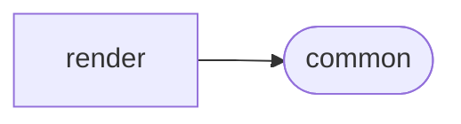

# Commonmark Render

[_Documentation generated by Documatic_](https://www.documatic.com)

<!---Documatic-section-Codebase Structure-start--->
## Codebase Structure

<!---Documatic-block-system_architecture-start--->

<!---Documatic-block-system_architecture-end--->

# #
<!---Documatic-section-Codebase Structure-end--->

<!---Documatic-section-commonmark.render.html.HtmlRenderer-start--->
## [commonmark.render.html.HtmlRenderer](10-commonmark_render.md#commonmark.render.html.HtmlRenderer)

<!---Documatic-section-HtmlRenderer-start--->
<!---Documatic-block-commonmark.render.html.HtmlRenderer-start--->
<details>
	<summary><code>commonmark.render.html.HtmlRenderer</code> code snippet</summary>

```python
class HtmlRenderer(Renderer):

    def __init__(self, options={}):
        options['softbreak'] = options.get('softbreak') or '\n'
        self.disable_tags = 0
        self.last_out = '\n'
        self.options = options

    def escape(self, text):
        return escape_xml(text)

    def tag(self, name, attrs=None, selfclosing=None):
        """Helper function to produce an HTML tag."""
        if self.disable_tags > 0:
            return
        self.buf += '<' + name
        if attrs and len(attrs) > 0:
            for attrib in attrs:
                self.buf += ' ' + attrib[0] + '="' + attrib[1] + '"'
        if selfclosing:
            self.buf += ' /'
        self.buf += '>'
        self.last_out = '>'

    def text(self, node, entering=None):
        self.out(node.literal)

    def softbreak(self, node=None, entering=None):
        self.lit(self.options['softbreak'])

    def linebreak(self, node=None, entering=None):
        self.tag('br', [], True)
        self.cr()

    def link(self, node, entering):
        attrs = self.attrs(node)
        if entering:
            if not (self.options.get('safe') and potentially_unsafe(node.destination)):
                attrs.append(['href', self.escape(node.destination)])
            if node.title:
                attrs.append(['title', self.escape(node.title)])
            self.tag('a', attrs)
        else:
            self.tag('/a')

    def image(self, node, entering):
        if entering:
            if self.disable_tags == 0:
                if self.options.get('safe') and potentially_unsafe(node.destination):
                    self.lit('')

    def emph(self, node, entering):
        self.tag('em' if entering else '/em')

    def strong(self, node, entering):
        self.tag('strong' if entering else '/strong')

    def paragraph(self, node, entering):
        grandparent = node.parent.parent
        attrs = self.attrs(node)
        if grandparent is not None and grandparent.t == 'list':
            if grandparent.list_data['tight']:
                return
        if entering:
            self.cr()
            self.tag('p', attrs)
        else:
            self.tag('/p')
            self.cr()

    def heading(self, node, entering):
        tagname = 'h' + str(node.level)
        attrs = self.attrs(node)
        if entering:
            self.cr()
            self.tag(tagname, attrs)
        else:
            self.tag('/' + tagname)
            self.cr()

    def code(self, node, entering):
        self.tag('code')
        self.out(node.literal)
        self.tag('/code')

    def code_block(self, node, entering):
        info_words = node.info.split() if node.info else []
        attrs = self.attrs(node)
        if len(info_words) > 0 and len(info_words[0]) > 0:
            attrs.append(['class', 'language-' + self.escape(info_words[0])])
        self.cr()
        self.tag('pre')
        self.tag('code', attrs)
        self.out(node.literal)
        self.tag('/code')
        self.tag('/pre')
        self.cr()

    def thematic_break(self, node, entering):
        attrs = self.attrs(node)
        self.cr()
        self.tag('hr', attrs, True)
        self.cr()

    def block_quote(self, node, entering):
        attrs = self.attrs(node)
        if entering:
            self.cr()
            self.tag('blockquote', attrs)
            self.cr()
        else:
            self.cr()
            self.tag('/blockquote')
            self.cr()

    def list(self, node, entering):
        tagname = 'ul' if node.list_data['type'] == 'bullet' else 'ol'
        attrs = self.attrs(node)
        if entering:
            start = node.list_data['start']
            if start is not None and start != 1:
                attrs.append(['start', str(start)])
            self.cr()
            self.tag(tagname, attrs)
            self.cr()
        else:
            self.cr()
            self.tag('/' + tagname)
            self.cr()

    def item(self, node, entering):
        attrs = self.attrs(node)
        if entering:
            self.tag('li', attrs)
        else:
            self.tag('/li')
            self.cr()

    def html_inline(self, node, entering):
        if self.options.get('safe'):
            self.lit('<!-- raw HTML omitted -->')
        else:
            self.lit(node.literal)

    def html_block(self, node, entering):
        self.cr()
        if self.options.get('safe'):
            self.lit('<!-- raw HTML omitted -->')
        else:
            self.lit(node.literal)
        self.cr()

    def custom_inline(self, node, entering):
        if entering and node.on_enter:
            self.lit(node.on_enter)
        elif not entering and node.on_exit:
            self.lit(node.on_exit)

    def custom_block(self, node, entering):
        self.cr()
        if entering and node.on_enter:
            self.lit(node.on_enter)
        elif not entering and node.on_exit:
            self.lit(node.on_exit)
        self.cr()

    def out(self, s):
        self.lit(self.escape(s))

    def attrs(self, node):
        att = []
        if self.options.get('sourcepos'):
            pos = node.sourcepos
            if pos:
                att.append(['data-sourcepos', str(pos[0][0]) + ':' + str(pos[0][1]) + '-' + str(pos[1][0]) + ':' + str(pos[1][1])])
        return att
```
</details>
<!---Documatic-block-commonmark.render.html.HtmlRenderer-end--->
<!---Documatic-section-HtmlRenderer-end--->

# #
<!---Documatic-section-commonmark.render.html.HtmlRenderer-end--->

<!---Documatic-section-commonmark.render.rst.ReStructuredTextRenderer-start--->
## [commonmark.render.rst.ReStructuredTextRenderer](10-commonmark_render.md#commonmark.render.rst.ReStructuredTextRenderer)

<!---Documatic-section-ReStructuredTextRenderer-start--->
<!---Documatic-block-commonmark.render.rst.ReStructuredTextRenderer-start--->
<details>
	<summary><code>commonmark.render.rst.ReStructuredTextRenderer</code> code snippet</summary>

```python
class ReStructuredTextRenderer(Renderer):

    def __init__(self, indent_char=' '):
        self.indent_char = indent_char
        self.indent_length = 0

    def lit(self, s):
        if s == '\n':
            indent = ''
        elif self.last_out != '\n':
            indent = ''
        else:
            indent = self.indent_char * self.indent_length
        return super(ReStructuredTextRenderer, self).lit(indent + s)

    def cr(self):
        self.lit('\n')

    def indent_lines(self, literal, indent_length=4):
        indent = self.indent_char * indent_length
        new_lines = []
        for line in literal.splitlines():
            new_lines.append(indent + line)
        return '\n'.join(new_lines)

    def document(self, node, entering):
        pass

    def softbreak(self, node, entering):
        self.cr()

    def linebreak(self, node, entering):
        self.cr()
        self.cr()

    def text(self, node, entering):
        self.out(node.literal)

    def emph(self, node, entering):
        self.out('*')

    def strong(self, node, entering):
        self.out('**')

    def paragraph(self, node, entering):
        if node.parent.t == 'item':
            pass
        else:
            self.cr()

    def link(self, node, entering):
        if entering:
            self.out('`')
        else:
            self.out(' <%s>`_' % node.destination)

    def image(self, node, entering):
        directive = '.. image:: ' + node.destination
        if entering:
            self.out(directive)
            self.cr()
            self.indent_length += 4
            self.out(':alt: ')
        else:
            self.indent_length -= 4

    def code(self, node, entering):
        self.out('``')
        self.out(node.literal)
        self.out('``')

    def code_block(self, node, entering):
        directive = '.. code::'
        language_name = None
        info_words = node.info.split() if node.info else []
        if len(info_words) > 0 and len(info_words[0]) > 0:
            language_name = info_words[0]
        if language_name:
            directive += ' ' + language_name
        self.cr()
        self.out(directive)
        self.cr()
        self.cr()
        self.out(self.indent_lines(node.literal))
        self.cr()

    def list(self, node, entering):
        if entering:
            self.cr()

    def item(self, node, entering):
        tagname = '* ' if node.list_data['type'] == 'bullet' else '#. '
        if entering:
            self.out(tagname)
            self.indent_length += len(tagname)
        else:
            self.indent_length -= len(tagname)
            self.cr()

    def block_quote(self, node, entering):
        if entering:
            self.indent_length += 4
        else:
            self.indent_length -= 4

    def heading(self, node, entering):
        heading_chars = ['#', '*', '=', '-', '^', '"']
        try:
            heading_char = heading_chars[node.level - 1]
        except IndexError:
            heading_char = heading_chars[-1]
        heading_length = len(node.first_child.literal)
        banner = heading_char * heading_length
        if entering:
            self.cr()
        else:
            self.cr()
            self.out(banner)
            self.cr()
```
</details>
<!---Documatic-block-commonmark.render.rst.ReStructuredTextRenderer-end--->
<!---Documatic-section-ReStructuredTextRenderer-end--->

# #
<!---Documatic-section-commonmark.render.rst.ReStructuredTextRenderer-end--->

[_Documentation generated by Documatic_](https://www.documatic.com)