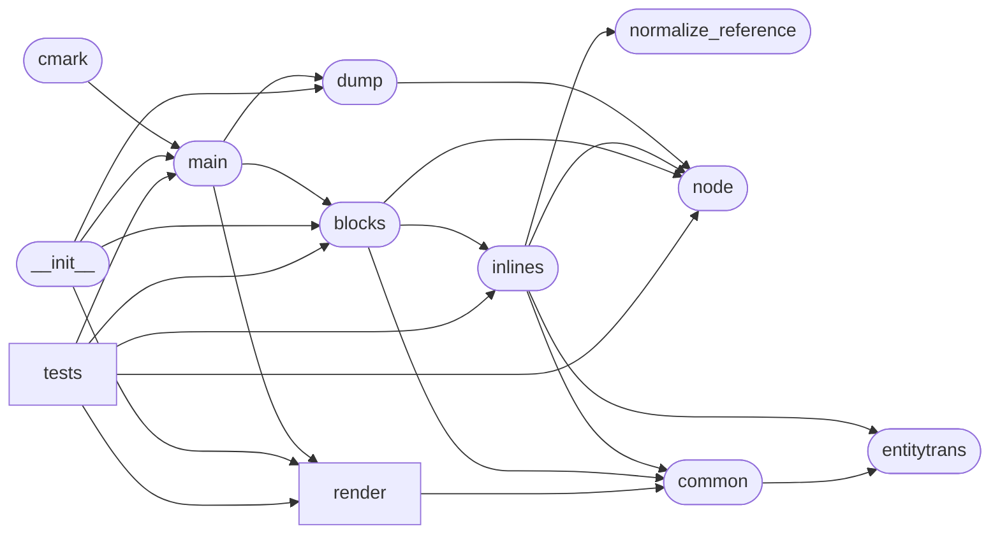

# Code Overview

[_Documentation generated by Documatic_](https://www.documatic.com)

<!---Documatic-section-Codebase Structure Python-start--->
## Codebase Structure Python

The codebase has a single-depth folder structure,
                with 18 code files in total.

<!---Documatic-block-system_architecture-start--->

<!---Documatic-block-system_architecture-end--->

# #
<!---Documatic-section-Codebase Structure Python-end--->

<!---Documatic-section-Key Objects-start--->
## Key Objects

There are exposed imports at level-0
from the source directory (commonmark)

<!---Documatic-block-commonmark-start--->

	
<code>commonmark</code> (Click to Expand!)

* `commonmark.blocks.Parser`
* `commonmark.dump.dumpAST`
* `commonmark.dump.dumpJSON`
* `commonmark.main.commonmark`
* `commonmark.render.html.HtmlRenderer`
* `commonmark.render.rst.ReStructuredTextRenderer`

<!---Documatic-block-commonmark-end--->

# #
<!---Documatic-section-Key Objects-end--->

<!---Documatic-section-Important Functions-start--->
## Important Functions

<!---Documatic-block-important_funcs-start--->
<!---Documatic-block-most_used_funcs-start--->
### Most Utilised Functions

* [commonmark.main.commonmark](5-commonmark_main.md#commonmark.main.commonmark) (4 times)
* [commonmark.dump.dumpAST](6-commonmark_dump.md#commonmark.dump.dumpAST) (2 times)
* [commonmark.dump.dumpJSON](6-commonmark_dump.md#commonmark.dump.dumpJSON) (2 times)
* [commonmark.common.unescape_string](9-commonmark_common.md#commonmark.common.unescape_string) (2 times)
* [commonmark.entitytrans._unescape](3-commonmark_entitytrans.md#commonmark.entitytrans._unescape) (2 times)
* [commonmark.node.is_container](8-commonmark_node.md#commonmark.node.is_container) (1 times)
* [commonmark.common.normalize_uri](9-commonmark_common.md#commonmark.common.normalize_uri) (1 times)
* commonmark.normalize_reference.normalize_reference (1 times)
* [commonmark.common.escape_xml](9-commonmark_common.md#commonmark.common.escape_xml) (1 times)
* commonmark.main.dumpAST (1 times)
<!---Documatic-block-most_used_funcs-end--->

<!---Documatic-block-end_user_funcs-start--->
### End User Exposed Functions

* [commonmark.main.commonmark](5-commonmark_main.md#commonmark.main.commonmark)
* [commonmark.render.html.HtmlRenderer](10-commonmark_render.md#commonmark.render.html.HtmlRenderer)
* [commonmark.render.rst.ReStructuredTextRenderer](10-commonmark_render.md#commonmark.render.rst.ReStructuredTextRenderer)
* [commonmark.blocks.Parser](7-commonmark_blocks.md#commonmark.blocks.Parser)
* [commonmark.dump.dumpAST](6-commonmark_dump.md#commonmark.dump.dumpAST)
* [commonmark.dump.dumpJSON](6-commonmark_dump.md#commonmark.dump.dumpJSON)
<!---Documatic-block-end_user_funcs-end--->
<!---Documatic-block-important_funcs-end--->

# #
<!---Documatic-section-Important Functions-end--->

<!---Documatic-section-File IO-start--->
## File IO

<!---Documatic-block-file_io-start--->
The following files have file read operations

<!---Documatic-block-commonmark.tests-start--->

	
<code>commonmark.tests</code> (Click to Expand!)

* commonmark.tests.run_spec_tests: spec.txt

<!---Documatic-block-commonmark.tests-end--->
<!---Documatic-block-file_io-end--->

# #
<!---Documatic-section-File IO-end--->

<!---Documatic-section-Class Hierarchy-start--->
## Class Hierarchy

<!---Documatic-block-commonmark.blocks.CodeBlock-start--->

	
<code>commonmark.blocks.CodeBlock</code> (Click to Expand!)

* commonmark.blocks.BlockQuote
* commonmark.blocks.CodeBlock
* commonmark.blocks.Document
* commonmark.blocks.Heading
* commonmark.blocks.HtmlBlock
* commonmark.blocks.Item
* commonmark.blocks.List
* commonmark.blocks.Paragraph
* commonmark.blocks.ThematicBreak

<!---Documatic-block-commonmark.blocks.CodeBlock-end--->

<!---Documatic-block-commonmark.render.html.HtmlRenderer-start--->

	
<code>commonmark.render.html.HtmlRenderer</code> (Click to Expand!)

* [commonmark.render.html.HtmlRenderer](10-commonmark_render.md#commonmark.render.html.HtmlRenderer)
* [commonmark.render.rst.ReStructuredTextRenderer](10-commonmark_render.md#commonmark.render.rst.ReStructuredTextRenderer)

<!---Documatic-block-commonmark.render.html.HtmlRenderer-end--->

<!---Documatic-block-object-start--->

	
<code>object</code> (Click to Expand!)

* commonmark.inlines.InlineParser

<!---Documatic-block-object-end--->

# #
<!---Documatic-section-Class Hierarchy-end--->

[_Documentation generated by Documatic_](https://www.documatic.com)