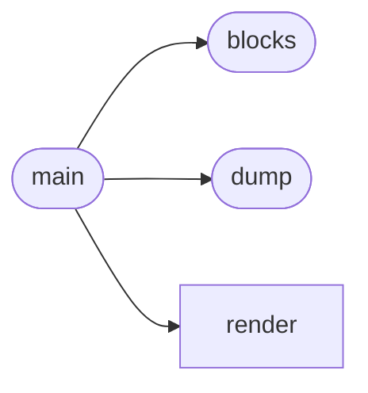
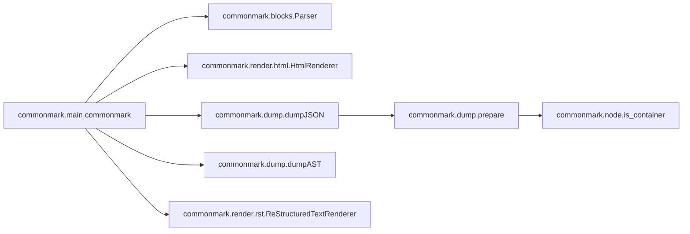

# Commonmark Main

[_Documentation generated by Documatic_](https://www.documatic.com)

<!---Documatic-section-Codebase Structure-start--->
## Codebase Structure

<!---Documatic-block-system_architecture-start--->

<!---Documatic-block-system_architecture-end--->

# #
<!---Documatic-section-Codebase Structure-end--->

<!---Documatic-section-commonmark.main.commonmark-start--->
## [commonmark.main.commonmark](5-commonmark_main.md#commonmark.main.commonmark)

<!---Documatic-section-commonmark-start--->


### Object Calls

* [commonmark.blocks.Parser](7-commonmark_blocks.md#commonmark.blocks.Parser)
* [commonmark.render.html.HtmlRenderer](10-commonmark_render.md#commonmark.render.html.HtmlRenderer)
* [commonmark.dump.dumpJSON](6-commonmark_dump.md#commonmark.dump.dumpJSON)
* [commonmark.dump.dumpAST](6-commonmark_dump.md#commonmark.dump.dumpAST)
* [commonmark.render.rst.ReStructuredTextRenderer](10-commonmark_render.md#commonmark.render.rst.ReStructuredTextRenderer)

<!---Documatic-block-commonmark.main.commonmark-start--->
<details>
	<summary><code>commonmark.main.commonmark</code> code snippet</summary>

```python
def commonmark(text, format='html'):
    parser = Parser()
    ast = parser.parse(text)
    if format not in ['html', 'json', 'ast', 'rst']:
        raise ValueError("format must be 'html', 'json' or 'ast'")
    if format == 'html':
        renderer = HtmlRenderer()
        return renderer.render(ast)
    if format == 'json':
        return dumpJSON(ast)
    if format == 'ast':
        return dumpAST(ast)
    if format == 'rst':
        renderer = ReStructuredTextRenderer()
        return renderer.render(ast)
```
</details>
<!---Documatic-block-commonmark.main.commonmark-end--->
<!---Documatic-section-commonmark-end--->

# #
<!---Documatic-section-commonmark.main.commonmark-end--->

[_Documentation generated by Documatic_](https://www.documatic.com)