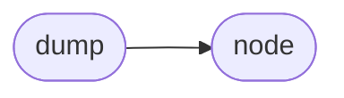

# Commonmark Dump

[_Documentation generated by Documatic_](https://www.documatic.com)

<!---Documatic-section-Codebase Structure-start--->
## Codebase Structure

<!---Documatic-block-system_architecture-start--->

<!---Documatic-block-system_architecture-end--->

# #
<!---Documatic-section-Codebase Structure-end--->

<!---Documatic-section-commonmark.dump.dumpAST-start--->
## [commonmark.dump.dumpAST](6-commonmark_dump.md#commonmark.dump.dumpAST)

<!---Documatic-section-dumpAST-start--->
<!---Documatic-block-commonmark.dump.dumpAST-start--->
<details>
	<summary><code>commonmark.dump.dumpAST</code> code snippet</summary>

```python
def dumpAST(obj, ind=0, topnode=False):
    indChar = '\t' * ind + '-> ' if ind else ''
    print(indChar + '[' + obj.t + ']')
    if not obj.title == '':
        print('\t' + indChar + 'Title: ' + (obj.title or ''))
    if not obj.info == '':
        print('\t' + indChar + 'Info: ' + (obj.info or ''))
    if not obj.destination == '':
        print('\t' + indChar + 'Destination: ' + (obj.destination or ''))
    if obj.is_open:
        print('\t' + indChar + 'Open: ' + str(obj.is_open))
    if obj.last_line_blank:
        print('\t' + indChar + 'Last line blank: ' + str(obj.last_line_blank))
    if obj.sourcepos:
        print('\t' + indChar + 'Sourcepos: ' + str(obj.sourcepos))
    if not obj.string_content == '':
        print('\t' + indChar + 'String content: ' + (obj.string_content or ''))
    if not obj.info == '':
        print('\t' + indChar + 'Info: ' + (obj.info or ''))
    if not obj.literal == '':
        print('\t' + indChar + 'Literal: ' + (obj.literal or ''))
    if obj.list_data.get('type'):
        print('\t' + indChar + 'List Data: ')
        print('\t\t' + indChar + '[type] = ' + obj.list_data.get('type'))
        if obj.list_data.get('bullet_char'):
            print('\t\t' + indChar + '[bullet_char] = ' + obj.list_data['bullet_char'])
        if obj.list_data.get('start'):
            print('\t\t' + indChar + '[start] = ' + str(obj.list_data.get('start')))
        if obj.list_data.get('delimiter'):
            print('\t\t' + indChar + '[delimiter] = ' + obj.list_data.get('delimiter'))
        if obj.list_data.get('padding'):
            print('\t\t' + indChar + '[padding] = ' + str(obj.list_data.get('padding')))
        if obj.list_data.get('marker_offset'):
            print('\t\t' + indChar + '[marker_offset] = ' + str(obj.list_data.get('marker_offset')))
    if obj.walker:
        print('\t' + indChar + 'Children:')
        walker = obj.walker()
        nxt = walker.nxt()
        while nxt is not None and topnode is False:
            dumpAST(nxt['node'], ind + 2, topnode=True)
            nxt = walker.nxt()
```
</details>
<!---Documatic-block-commonmark.dump.dumpAST-end--->
<!---Documatic-section-dumpAST-end--->

# #
<!---Documatic-section-commonmark.dump.dumpAST-end--->

<!---Documatic-section-commonmark.dump.dumpJSON-start--->
## [commonmark.dump.dumpJSON](6-commonmark_dump.md#commonmark.dump.dumpJSON)

<!---Documatic-section-dumpJSON-start--->


### Object Calls

* [commonmark.dump.prepare](6-commonmark_dump.md#commonmark.dump.prepare)

<!---Documatic-block-commonmark.dump.dumpJSON-start--->
<details>
	<summary><code>commonmark.dump.dumpJSON</code> code snippet</summary>

```python
def dumpJSON(obj):
    prepared = prepare(obj)
    return json.dumps(prepared, indent=4, sort_keys=True)
```
</details>
<!---Documatic-block-commonmark.dump.dumpJSON-end--->
<!---Documatic-section-dumpJSON-end--->

# #
<!---Documatic-section-commonmark.dump.dumpJSON-end--->

<!---Documatic-section-commonmark.dump.prepare-start--->
## [commonmark.dump.prepare](6-commonmark_dump.md#commonmark.dump.prepare)

<!---Documatic-section-prepare-start--->


### Object Calls

* [commonmark.node.is_container](8-commonmark_node.md#commonmark.node.is_container)

<!---Documatic-block-commonmark.dump.prepare-start--->
<details>
	<summary><code>commonmark.dump.prepare</code> code snippet</summary>

```python
def prepare(obj, topnode=False):
    a = []
    for (subnode, entered) in obj.walker():
        rep = {'type': subnode.t}
        if subnode.literal:
            rep['literal'] = subnode.literal
        if subnode.string_content:
            rep['string_content'] = subnode.string_content
        if subnode.title:
            rep['title'] = subnode.title
        if subnode.info:
            rep['info'] = subnode.info
        if subnode.destination:
            rep['destination'] = subnode.destination
        if subnode.list_data:
            rep['list_data'] = subnode.list_data
        if is_container(subnode):
            rep['children'] = []
        if entered and len(a) > 0:
            if a[-1]['children']:
                a[-1]['children'].append(rep)
            else:
                a[-1]['children'] = [rep]
        else:
            a.append(rep)
    return a
```
</details>
<!---Documatic-block-commonmark.dump.prepare-end--->
<!---Documatic-section-prepare-end--->

# #
<!---Documatic-section-commonmark.dump.prepare-end--->

[_Documentation generated by Documatic_](https://www.documatic.com)