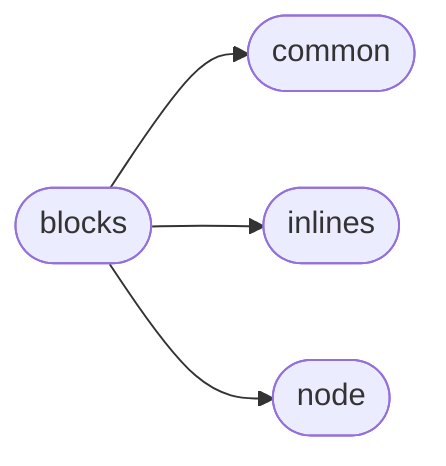

# Commonmark Blocks

[_Documentation generated by Documatic_](https://www.documatic.com)

<!---Documatic-section-Codebase Structure-start--->
## Codebase Structure

<!---Documatic-block-system_architecture-start--->

<!---Documatic-block-system_architecture-end--->

# #
<!---Documatic-section-Codebase Structure-end--->

<!---Documatic-section-commonmark.blocks.Parser-start--->
## [commonmark.blocks.Parser](7-commonmark_blocks.md#commonmark.blocks.Parser)

<!---Documatic-section-Parser-start--->
<!---Documatic-block-commonmark.blocks.Parser-start--->
<details>
	<summary><code>commonmark.blocks.Parser</code> code snippet</summary>

```python
class Parser(object):

    def __init__(self, options={}):
        self.doc = Node('document', [[1, 1], [0, 0]])
        self.block_starts = BlockStarts()
        self.tip = self.doc
        self.oldtip = self.doc
        self.current_line = ''
        self.line_number = 0
        self.offset = 0
        self.column = 0
        self.next_nonspace = 0
        self.next_nonspace_column = 0
        self.indent = 0
        self.indented = False
        self.blank = False
        self.partially_consumed_tab = False
        self.all_closed = True
        self.last_matched_container = self.doc
        self.refmap = {}
        self.last_line_length = 0
        self.inline_parser = InlineParser(options)
        self.options = options

    def add_line(self):
        """ Add a line to the block at the tip.  We assume the tip
        can accept lines -- that check should be done before calling this."""
        if self.partially_consumed_tab:
            self.offset += 1
            chars_to_tab = 4 - self.column % 4
            self.tip.string_content += ' ' * chars_to_tab
        self.tip.string_content += self.current_line[self.offset:] + '\n'

    def add_child(self, tag, offset):
        """ Add block of type tag as a child of the tip.  If the tip can't
        accept children, close and finalize it and try its parent,
        and so on til we find a block that can accept children."""
        while not self.blocks[self.tip.t].can_contain(tag):
            self.finalize(self.tip, self.line_number - 1)
        column_number = offset + 1
        new_block = Node(tag, [[self.line_number, column_number], [0, 0]])
        new_block.string_content = ''
        self.tip.append_child(new_block)
        self.tip = new_block
        return new_block

    def close_unmatched_blocks(self):
        """Finalize and close any unmatched blocks."""
        if not self.all_closed:
            while self.oldtip != self.last_matched_container:
                parent = self.oldtip.parent
                self.finalize(self.oldtip, self.line_number - 1)
                self.oldtip = parent
            self.all_closed = True

    def find_next_nonspace(self):
        current_line = self.current_line
        i = self.offset
        cols = self.column
        try:
            c = current_line[i]
        except IndexError:
            c = ''
        while c != '':
            if c == ' ':
                i += 1
                cols += 1
            elif c == '\t':
                i += 1
                cols += 4 - cols % 4
            else:
                break
            try:
                c = current_line[i]
            except IndexError:
                c = ''
        self.blank = c == '\n' or c == '\r' or c == ''
        self.next_nonspace = i
        self.next_nonspace_column = cols
        self.indent = self.next_nonspace_column - self.column
        self.indented = self.indent >= CODE_INDENT

    def advance_next_nonspace(self):
        self.offset = self.next_nonspace
        self.column = self.next_nonspace_column
        self.partially_consumed_tab = False

    def advance_offset(self, count, columns):
        current_line = self.current_line
        try:
            c = current_line[self.offset]
        except IndexError:
            c = None
        while count > 0 and c is not None:
            if c == '\t':
                chars_to_tab = 4 - self.column % 4
                if columns:
                    self.partially_consumed_tab = chars_to_tab > count
                    chars_to_advance = min(count, chars_to_tab)
                    self.column += chars_to_advance
                    self.offset += 0 if self.partially_consumed_tab else 1
                    count -= chars_to_advance
                else:
                    self.partially_consumed_tab = False
                    self.column += chars_to_tab
                    self.offset += 1
                    count -= 1
            else:
                self.partially_consumed_tab = False
                self.offset += 1
                self.column += 1
                count -= 1
            try:
                c = current_line[self.offset]
            except IndexError:
                c = None

    def incorporate_line(self, ln):
        """Analyze a line of text and update the document appropriately.

        We parse markdown text by calling this on each line of input,
        then finalizing the document.
        """
        all_matched = True
        container = self.doc
        self.oldtip = self.tip
        self.offset = 0
        self.column = 0
        self.blank = False
        self.partially_consumed_tab = False
        self.line_number += 1
        if re.search('\\u0000', ln) is not None:
            ln = re.sub('\\0', '�', ln)
        self.current_line = ln
        while True:
            last_child = container.last_child
            if not (last_child and last_child.is_open):
                break
            container = last_child
            self.find_next_nonspace()
            rv = self.blocks[container.t].continue_(self, container)
            if rv == 0:
                pass
            elif rv == 1:
                all_matched = False
            elif rv == 2:
                self.last_line_length = len(ln)
                return
            else:
                raise ValueError('continue_ returned illegal value, must be 0, 1, or 2')
            if not all_matched:
                container = container.parent
                break
        self.all_closed = container == self.oldtip
        self.last_matched_container = container
        matched_leaf = container.t != 'paragraph' and self.blocks[container.t].accepts_lines
        starts = self.block_starts
        starts_len = len(starts.METHODS)
        while not matched_leaf:
            self.find_next_nonspace()
            if not self.indented and (not re.search(reMaybeSpecial, ln[self.next_nonspace:])):
                self.advance_next_nonspace()
                break
            i = 0
            while i < starts_len:
                res = getattr(starts, starts.METHODS[i])(self, container)
                if res == 1:
                    container = self.tip
                    break
                elif res == 2:
                    container = self.tip
                    matched_leaf = True
                    break
                else:
                    i += 1
            if i == starts_len:
                self.advance_next_nonspace()
                break
        if not self.all_closed and (not self.blank) and (self.tip.t == 'paragraph'):
            self.add_line()
        else:
            self.close_unmatched_blocks()
            if self.blank and container.last_child:
                container.last_child.last_line_blank = True
            t = container.t
            last_line_blank = self.blank and (not (t == 'block_quote' or (t == 'code_block' and container.is_fenced) or (t == 'item' and (not container.first_child) and (container.sourcepos[0][0] == self.line_number))))
            cont = container
            while cont:
                cont.last_line_blank = last_line_blank
                cont = cont.parent
            if self.blocks[t].accepts_lines:
                self.add_line()
                if t == 'html_block' and container.html_block_type >= 1 and (container.html_block_type <= 5) and re.search(reHtmlBlockClose[container.html_block_type], self.current_line[self.offset:]):
                    self.finalize(container, self.line_number)
            elif self.offset < len(ln) and (not self.blank):
                container = self.add_child('paragraph', self.offset)
                self.advance_next_nonspace()
                self.add_line()
        self.last_line_length = len(ln)

    def finalize(self, block, line_number):
        """ Finalize a block.  Close it and do any necessary postprocessing,
        e.g. creating string_content from strings, setting the 'tight'
        or 'loose' status of a list, and parsing the beginnings
        of paragraphs for reference definitions.  Reset the tip to the
        parent of the closed block."""
        above = block.parent
        block.is_open = False
        block.sourcepos[1] = [line_number, self.last_line_length]
        self.blocks[block.t].finalize(self, block)
        self.tip = above

    def process_inlines(self, block):
        """
        Walk through a block & children recursively, parsing string content
        into inline content where appropriate.
        """
        walker = block.walker()
        self.inline_parser.refmap = self.refmap
        self.inline_parser.options = self.options
        event = walker.nxt()
        while event is not None:
            node = event['node']
            t = node.t
            if not event['entering'] and (t == 'paragraph' or t == 'heading'):
                self.inline_parser.parse(node)
            event = walker.nxt()

    def parse(self, my_input):
        """ The main parsing function.  Returns a parsed document AST."""
        self.doc = Node('document', [[1, 1], [0, 0]])
        self.tip = self.doc
        self.refmap = {}
        self.line_number = 0
        self.last_line_length = 0
        self.offset = 0
        self.column = 0
        self.last_matched_container = self.doc
        self.current_line = ''
        lines = re.split(reLineEnding, my_input)
        length = len(lines)
        if len(my_input) > 0 and my_input[-1] == '\n':
            length -= 1
        for i in range(length):
            self.incorporate_line(lines[i])
        while self.tip:
            self.finalize(self.tip, length)
        self.process_inlines(self.doc)
        return self.doc
```
</details>
<!---Documatic-block-commonmark.blocks.Parser-end--->
<!---Documatic-section-Parser-end--->

# #
<!---Documatic-section-commonmark.blocks.Parser-end--->

[_Documentation generated by Documatic_](https://www.documatic.com)