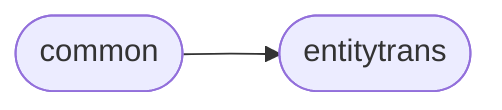

# Commonmark Common

[_Documentation generated by Documatic_](https://www.documatic.com)

<!---Documatic-section-Codebase Structure-start--->
## Codebase Structure

<!---Documatic-block-system_architecture-start--->

<!---Documatic-block-system_architecture-end--->

# #
<!---Documatic-section-Codebase Structure-end--->

<!---Documatic-section-commonmark.common.unescape_string-start--->
## [commonmark.common.unescape_string](9-commonmark_common.md#commonmark.common.unescape_string)

<!---Documatic-section-unescape_string-start--->


### Object Calls

* [commonmark.common.unescape_char](9-commonmark_common.md#commonmark.common.unescape_char)

<!---Documatic-block-commonmark.common.unescape_string-start--->
<details>
	<summary><code>commonmark.common.unescape_string</code> code snippet</summary>

```python
def unescape_string(s):
    if re.search(reBackslashOrAmp, s):
        return re.sub(reEntityOrEscapedChar, lambda m: unescape_char(m.group()), s)
    else:
        return s
```
</details>
<!---Documatic-block-commonmark.common.unescape_string-end--->
<!---Documatic-section-unescape_string-end--->

# #
<!---Documatic-section-commonmark.common.unescape_string-end--->

<!---Documatic-section-commonmark.common.normalize_uri-start--->
## [commonmark.common.normalize_uri](9-commonmark_common.md#commonmark.common.normalize_uri)

<!---Documatic-section-normalize_uri-start--->
<!---Documatic-block-commonmark.common.normalize_uri-start--->
<details>
	<summary><code>commonmark.common.normalize_uri</code> code snippet</summary>

```python
def normalize_uri(uri):
    try:
        return quote(uri.encode('utf-8'), safe=str(';/@:+?=&()%#*,'))
    except UnicodeDecodeError:
        s = quote(uri.encode('utf-8'))
        s = re.sub('%40', '@', s)
        s = re.sub('%3A', ':', s)
        s = re.sub('%2B', '+', s)
        s = re.sub('%3F', '?', s)
        s = re.sub('%3D', '=', s)
        s = re.sub('%26', '&', s)
        s = re.sub('%28', '(', s)
        s = re.sub('%29', ')', s)
        s = re.sub('%25', '%', s)
        s = re.sub('%23', '#', s)
        s = re.sub('%2A', '*', s)
        s = re.sub('%2C', ',', s)
        return s
```
</details>
<!---Documatic-block-commonmark.common.normalize_uri-end--->
<!---Documatic-section-normalize_uri-end--->

# #
<!---Documatic-section-commonmark.common.normalize_uri-end--->

<!---Documatic-section-commonmark.common.escape_xml-start--->
## [commonmark.common.escape_xml](9-commonmark_common.md#commonmark.common.escape_xml)

<!---Documatic-section-escape_xml-start--->


### Object Calls

* [commonmark.common.replace_unsafe_char](9-commonmark_common.md#commonmark.common.replace_unsafe_char)

<!---Documatic-block-commonmark.common.escape_xml-start--->
<details>
	<summary><code>commonmark.common.escape_xml</code> code snippet</summary>

```python
def escape_xml(s):
    if s is None:
        return ''
    if re.search(reXmlSpecial, s):
        return re.sub(reXmlSpecial, lambda m: replace_unsafe_char(m.group()), s)
    else:
        return s
```
</details>
<!---Documatic-block-commonmark.common.escape_xml-end--->
<!---Documatic-section-escape_xml-end--->

# #
<!---Documatic-section-commonmark.common.escape_xml-end--->

<!---Documatic-section-commonmark.common.replace_unsafe_char-start--->
## [commonmark.common.replace_unsafe_char](9-commonmark_common.md#commonmark.common.replace_unsafe_char)

<!---Documatic-section-replace_unsafe_char-start--->
<!---Documatic-block-commonmark.common.replace_unsafe_char-start--->
<details>
	<summary><code>commonmark.common.replace_unsafe_char</code> code snippet</summary>

```python
def replace_unsafe_char(s):
    return UNSAFE_MAP.get(s, s)
```
</details>
<!---Documatic-block-commonmark.common.replace_unsafe_char-end--->
<!---Documatic-section-replace_unsafe_char-end--->

# #
<!---Documatic-section-commonmark.common.replace_unsafe_char-end--->

<!---Documatic-section-commonmark.common.unescape_char-start--->
## [commonmark.common.unescape_char](9-commonmark_common.md#commonmark.common.unescape_char)

<!---Documatic-section-unescape_char-start--->
<!---Documatic-block-commonmark.common.unescape_char-start--->
<details>
	<summary><code>commonmark.common.unescape_char</code> code snippet</summary>

```python
def unescape_char(s):
    if s[0] == '\\':
        return s[1]
    else:
        return HTMLunescape(s)
```
</details>
<!---Documatic-block-commonmark.common.unescape_char-end--->
<!---Documatic-section-unescape_char-end--->

# #
<!---Documatic-section-commonmark.common.unescape_char-end--->

[_Documentation generated by Documatic_](https://www.documatic.com)